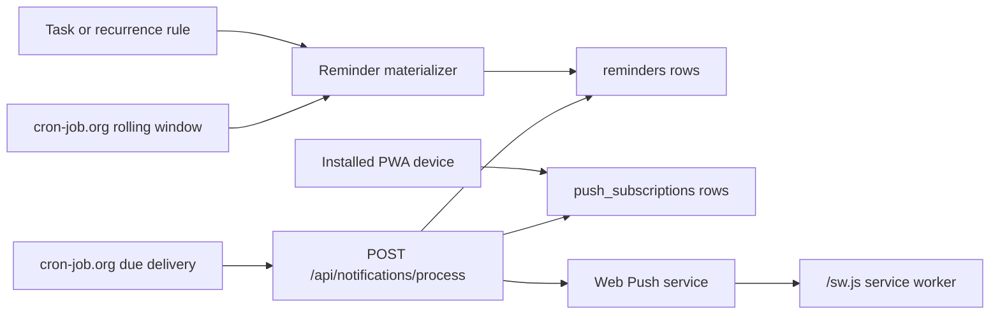

# Notifications Architecture

Circuit uses Web Push for reminders so notifications can arrive on every installed PWA device even when the app is closed. Browser timers are not part of the delivery path.

## Circuit task reminders



Tasks and recurrence rules decide what should be reminded. `reminders` rows decide when the reminder is eligible for delivery. `push_subscriptions` rows decide where it is delivered.

Registering a device re-enables or creates the current browser endpoint and disables older enabled endpoints with the same `device_name` and `platform`. Unsubscribing sends the same device profile and also retires matching stale endpoints. This keeps legitimate multi-device delivery while preventing duplicate reminders when a browser rotates its Web Push endpoint and the UI is enabled again.

Scheduled tasks with no reminders are treated as time-blocked work that happened unless corrected later: when the shared cron sees the task's scheduled block has ended, it marks the task complete and writes a normal `completed` history event with `reason: auto_no_reminder`. This completion participates in the energy timeline immediately. If the task did not actually happen, undo or edit it from History.

The backend materializes reminders only for a bounded upcoming window (`REMINDER_MATERIALIZE_DAYS`, default 7). Recurring tasks still remain recurrence definitions; Circuit does not generate infinite task rows.

Delivered task reminder copy is intentionally minimal:

- Notification title: the task text.
- Notification body: scheduled IST time plus compact planning signals, for example `11:30 AM IST · imp 80% · urg 70% · delay 60% · drain 40%`.
- `load NN%` is appended only for high cognitive-load tasks.

Circuit does not call Groq while processing due reminders. The parameters are the saved task fields, including AI-filled defaults when a task was originally created or imported.

## Data model

`push_subscriptions`

- `id`
- `user_id`
- `endpoint`
- `p256dh`
- `auth`
- `device_name`
- `platform`
- `enabled`
- `created_at`
- `updated_at`

`reminders`

- `id`
- `user_id`
- `task_id`
- `remind_at`
- `status`: `pending`, `processing`, `sent`, `failed`, `cancelled`
- `sent_at`
- `created_at`
- `updated_at`
- `attempts`
- `last_error`
- `occurrence_at_ms`

The extra operational columns support retries, logging, and virtual recurring occurrence reminders.

## API

- `GET /api/notifications/vapid-public-key`
- `POST /api/notifications/subscribe`
- `POST /api/notifications/unsubscribe`
- `POST /api/notifications/process`
- `POST /api/cron/materialize-occurrences`
- `POST /api/cron/materialize-reminders`
- `POST /api/cron/process-reminders`
- `POST /api/cron/auto-complete-no-reminder-tasks`
- `POST /api/cron/sync-icloud-calendar`

`/api/notifications/process` is the reminder-only processor and requires:

```http
Authorization: Bearer ${REMINDER_CRON_SECRET}
```

The shared backend cron endpoints use `CRON_SECRET`, but each endpoint now does only the work named in its path. `materialize-occurrences` refreshes recurring occurrence rows only. `sync-icloud-calendar` syncs only the iCloud mirror. Reminder row generation, reminder delivery, and no-reminder auto-completion are separate cron calls so production can tune each cadence independently.

## Service worker scope

The notification service worker must be served from the same base path as the installed PWA. Root deployments register `/sw.js`; subpath deployments such as `/circuit` register `/circuit/sw.js` and use the same base path for notification icons and click targets. Keep the manifest URL, service worker file, and installed app scope aligned.

## Vercel setup

Set these environment variables for the backend deployment:

```bash
VAPID_PUBLIC_KEY=...
VAPID_PRIVATE_KEY=...
VAPID_SUBJECT=mailto:you@example.com
REMINDER_CRON_SECRET=...
REMINDER_MATERIALIZE_DAYS=7
REMINDER_PROCESS_LOOKAHEAD_SECONDS=75
REMINDER_BATCH_SIZE=100
REMINDER_MAX_ATTEMPTS=3
REMINDER_STALE_AFTER_HOURS=6
```

Generate VAPID keys with a Web Push key generator, for example `npx web-push generate-vapid-keys`, then copy the public and private keys into Vercel.

Current low-quota production cadence:

```text
Daily:
POST https://<api-host>/api/cron/materialize-occurrences
Authorization: Bearer <CRON_SECRET>

Daily or after task/recurrence bulk changes:
POST https://<api-host>/api/cron/materialize-reminders
Authorization: Bearer <CRON_SECRET>

At the next due reminder time, or on a sparse fallback poll:
POST https://<api-host>/api/notifications/process
Authorization: Bearer <REMINDER_CRON_SECRET>

Every 30 minutes, when iCloud sync is enabled:
POST https://<api-host>/api/cron/sync-icloud-calendar
Authorization: Bearer <CRON_SECRET>

Every 30-60 minutes if no-reminder calendar blocks should auto-complete:
POST https://<api-host>/api/cron/auto-complete-no-reminder-tasks
Authorization: Bearer <CRON_SECRET>
```

`POST /api/notifications/process` is intentionally small and no longer materializes reminder rows. Due-reminder claiming is skipped when the next pending reminder is farther away than `REMINDER_PROCESS_LOOKAHEAD_SECONDS` (default 75). The response includes `next_due_at` and `seconds_until_next_due`, so an external scheduler that supports one-off scheduled calls can wake the app closer to the next reminder instead of polling every minute. Vercel cron and cron-job.org fixed jobs cannot dynamically reschedule themselves from this response; use a scheduler with delayed jobs, such as Upstash QStash, Trigger.dev, Cloudflare Queues plus a Worker cron, or a tiny long-lived worker, if exact ad-hoc wakeups matter. `REMINDER_STALE_AFTER_HOURS` cancels old pending reminder rows instead of delivering an outage backlog.

## Canopy and Chef lightweight reminders

For fixed daily reminders, use the same Web Push subscription table and service worker, but skip the `reminders` table. cron-job.org should call one endpoint at fixed times:

```text
Canopy:
11:00 POST /api/reminders/fixed?type=morning
17:00 POST /api/reminders/fixed?type=afternoon
22:00 POST /api/reminders/fixed?type=evening

Chef:
11:00 POST /api/reminders/fixed?type=breakfast
15:00 POST /api/reminders/fixed?type=lunch
22:00 POST /api/reminders/fixed?type=dinner
```

Or use one parameterized Vercel route:

```ts
export async function POST(req: Request) {
  const auth = req.headers.get("authorization");
  if (auth !== `Bearer ${process.env.REMINDER_CRON_SECRET}`) {
    return Response.json({ error: "unauthorized" }, { status: 401 });
  }

  const { searchParams } = new URL(req.url);
  const type = searchParams.get("type") ?? "morning";
  const messages = {
    morning: ["Capture any important people moments from the morning."],
    afternoon: ["Add what shifted with people since lunch."],
    evening: ["Close the loop on the people moments from today."],
    breakfast: ["Add breakfast while details are fresh."],
    lunch: ["Log lunch while details are fresh."],
    dinner: ["Add dinner before the day closes."],
  }[type] ?? ["Time for a quick check-in."];
  const dayIndex = Math.floor(Date.now() / 86_400_000) % messages.length;
  const message = messages[dayIndex];

  const subscriptions = await db.pushSubscription.findMany({ where: { enabled: true } });
  await Promise.all(subscriptions.map((sub) => sendWebPush(sub, {
    title: "Reminder",
    body: message,
    tag: `daily-${type}`,
    url: "/",
  })));

  return Response.json({ sent: subscriptions.length });
}
```

The important difference: Circuit has task-derived dynamic reminder rows; Canopy and Chef can operate from cron time alone.
