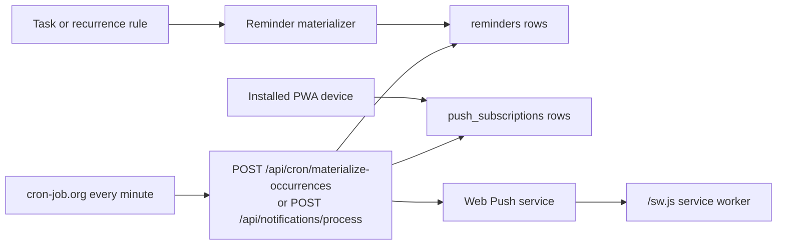

# Notifications Architecture

Circuit uses Web Push for reminders so notifications can arrive on every installed PWA device even when the app is closed. Browser timers are not part of the delivery path.

## Circuit task reminders



Tasks and recurrence rules decide what should be reminded. `reminders` rows decide when the reminder is eligible for delivery. `push_subscriptions` rows decide where it is delivered.

The backend materializes reminders only for a bounded upcoming window (`REMINDER_MATERIALIZE_DAYS`, default 7). Recurring tasks still remain recurrence definitions; Circuit does not generate infinite task rows.

## Data model

`push_subscriptions`

- `id`
- `user_id`
- `endpoint`
- `p256dh`
- `auth`
- `device_name`
- `platform`
- `enabled`
- `created_at`
- `updated_at`

`reminders`

- `id`
- `user_id`
- `task_id`
- `remind_at`
- `status`: `pending`, `processing`, `sent`, `failed`, `cancelled`
- `sent_at`
- `created_at`
- `updated_at`
- `attempts`
- `last_error`
- `occurrence_at_ms`

The extra operational columns support retries, logging, and virtual recurring occurrence reminders.

## API

- `GET /api/notifications/vapid-public-key`
- `POST /api/notifications/subscribe`
- `POST /api/notifications/unsubscribe`
- `POST /api/notifications/process`
- `POST /api/cron/materialize-occurrences`
- `POST /api/cron/sync-icloud-calendar`

`/api/notifications/process` is the reminder-only processor and requires:

```http
Authorization: Bearer ${REMINDER_CRON_SECRET}
```

The shared backend cron endpoints use `CRON_SECRET`. They now materialize upcoming reminder rows and process due reminder deliveries as part of their normal response, returning reminder counts such as `reminders_generated_count`, `claimed`, `sent`, `failed`, and `cancelled`.

## Vercel setup

Set these environment variables for the backend deployment:

```bash
VAPID_PUBLIC_KEY=...
VAPID_PRIVATE_KEY=...
VAPID_SUBJECT=mailto:you@example.com
REMINDER_CRON_SECRET=...
REMINDER_MATERIALIZE_DAYS=14
REMINDER_BATCH_SIZE=100
REMINDER_MAX_ATTEMPTS=3
```

Generate VAPID keys with a Web Push key generator, for example `npx web-push generate-vapid-keys`, then copy the public and private keys into Vercel.

Configure cron-job.org to call every minute:

```text
POST https://<api-host>/api/cron/materialize-occurrences
Authorization: Bearer <CRON_SECRET>
```

If an existing every-minute job already calls `POST /api/cron/sync-icloud-calendar`, that job also processes due reminders. A separate `POST /api/notifications/process` job is only needed when reminders should run independently from the shared Circuit cron job.

## Canopy and Chef lightweight reminders

For fixed daily reminders, use the same Web Push subscription table and service worker, but skip the `reminders` table. cron-job.org should call one endpoint at fixed times:

```text
09:00 POST /api/reminders/send?type=morning
14:00 POST /api/reminders/send?type=afternoon
20:00 POST /api/reminders/send?type=evening
```

Or use one parameterized Vercel route:

```ts
export async function POST(req: Request) {
  const auth = req.headers.get("authorization");
  if (auth !== `Bearer ${process.env.REMINDER_CRON_SECRET}`) {
    return Response.json({ error: "unauthorized" }, { status: 401 });
  }

  const { searchParams } = new URL(req.url);
  const type = searchParams.get("type") ?? "morning";
  const message = {
    morning: "Start the day with a quick check-in.",
    afternoon: "Take a moment to update your progress.",
    evening: "Wrap up and reflect on the day.",
  }[type] ?? "Time for a quick check-in.";

  const subscriptions = await db.pushSubscription.findMany({ where: { enabled: true } });
  await Promise.all(subscriptions.map((sub) => sendWebPush(sub, {
    title: "Reminder",
    body: message,
    tag: `daily-${type}`,
    url: "/",
  })));

  return Response.json({ sent: subscriptions.length });
}
```

The important difference: Circuit has task-derived dynamic reminder rows; Canopy and Chef can operate from cron time alone.
