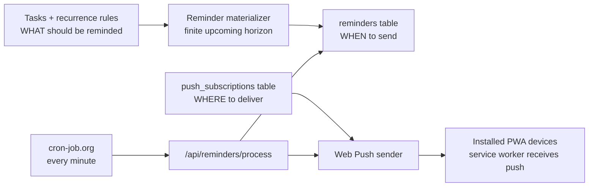

# Reminder System

Circuit supports two reminder shapes:

1. Production task reminders for one-time and recurring tasks.
2. Lightweight fixed daily reminders for small apps such as habit trackers, journaling, gratitude, Canopy, or Chef.

The TypeScript implementation lives in the Next.js app under `frontend/src/server/reminders` and is exposed through Vercel route handlers under `frontend/src/app/api`.

## Architecture



### Database Responsibilities

`push_subscriptions` stores one row per installed browser/device. A user can have many enabled devices, and each reminder is sent to every enabled subscription.

`reminders` stores a finite send queue. Task and recurrence rules decide what should exist; reminder rows decide when delivery should be attempted. The queue gives the processor a durable source of truth, so delivery does not rely on browser timers or the app staying open.

`circuit_tasks` keeps recurrence rules. The system does not generate infinite task rows. UI can expand occurrences virtually, while the reminder processor only materializes rows within `REMINDER_MATERIALIZE_DAYS`. The default reminder window is 7 days.

## API

### `GET /api/notifications/vapid-public-key`

Returns the public VAPID key for the browser subscription flow.

### `POST /api/notifications/subscribe`

Authenticated. Upserts a device subscription by `(user_id, endpoint)`, enables it, refreshes keys/device metadata, and materializes upcoming reminders.

```json
{
  "endpoint": "https://push.example/subscription",
  "keys": { "p256dh": "...", "auth": "..." },
  "device_name": "Mobile PWA",
  "platform": "iPhone"
}
```

### `POST /api/notifications/unsubscribe`

Authenticated. Disables the matching endpoint for the current user.

### `POST /api/notifications/send`

Authenticated direct-send endpoint for explicit user-triggered notifications. This is useful for testing and for product flows that need an immediate notification.

### `GET|POST /api/reminders/process`

Cron-protected. Requires:

```http
Authorization: Bearer <REMINDER_CRON_SECRET>
```

The endpoint:

- materializes upcoming reminders from one-time and recurring tasks,
- claims due reminders with `FOR UPDATE SKIP LOCKED`,
- sends Web Push notifications to all enabled devices,
- marks reminders `sent`, `failed`, or `cancelled`,
- increments attempts and records `last_error`,
- disables invalid push subscriptions on `404` or `410`.

## Concurrency and Duplicate Prevention

The reminder processor is safe to call every minute and safe to overlap:

- `reminders` has `unique(user_id, task_id, remind_at)` so materialization is idempotent.
- due rows are claimed with a single `UPDATE ... WHERE id IN (SELECT ... FOR UPDATE SKIP LOCKED ...) RETURNING *`.
- a claimed row is moved to `processing` before sending.
- only rows in `pending` or retryable `failed` are claimable.
- a reminder is marked `sent` only after at least one enabled subscription accepts the push request.

This means cron-job.org can retry transient failures without causing duplicate sends for the same reminder row.

## Recurrence

The TypeScript materializer supports Circuit's common recurrence patterns:

- `daily`
- `weekday`
- `weekend`
- `weekly`
- `weekly:MO,WE,FR`
- `every:4d`
- `every:2w`

The materializer intentionally creates only finite reminder rows between now and `REMINDER_MATERIALIZE_DAYS`. Completion, skip, reschedule, and recurrence edits should cancel or update affected pending reminder rows in the task mutation path, then call `materializeUpcomingReminders()`.

## Vercel Environment

Set these on the Vercel project:

```bash
DATABASE_URL=postgresql://...
VAPID_PUBLIC_KEY=...
VAPID_PRIVATE_KEY=...
VAPID_SUBJECT=mailto:you@example.com
REMINDER_CRON_SECRET=<long random token>
REMINDER_MATERIALIZE_DAYS=7
REMINDER_BATCH_SIZE=100
REMINDER_MAX_ATTEMPTS=5
```

Generate VAPID keys once:

```bash
npx web-push generate-vapid-keys
```

Run the migration against Neon before enabling cron:

```bash
psql "$DATABASE_URL" -f frontend/migrations/001_reminders.sql
```

## cron-job.org Setup

Create a job that runs every minute:

- URL: `https://<your-app>.vercel.app/api/reminders/process`
- Method: `POST`
- Header: `Authorization: Bearer <REMINDER_CRON_SECRET>`
- Timeout: 60 seconds

For fixed small-app reminders, create three daily jobs:

- `09:00` -> `POST /api/reminders/fixed?type=morning`
- `14:00` -> `POST /api/reminders/fixed?type=afternoon`
- `20:00` -> `POST /api/reminders/fixed?type=evening`

Those endpoints reuse `push_subscriptions` and do not require a `reminders` table.

## Service Worker

`frontend/public/sw.js` handles `push` and `notificationclick`. Because push is delivered to the service worker, notifications still arrive when the PWA is closed, as long as the browser/device allows Web Push and the subscription remains valid.

## Operational Notes

- Invalid subscriptions are disabled, not deleted, preserving auditability and avoiding repeated failed sends.
- Transient provider failures remain retryable until `REMINDER_MAX_ATTEMPTS`.
- `REMINDER_BATCH_SIZE` keeps each Vercel invocation bounded.
- `REMINDER_MATERIALIZE_DAYS` controls database footprint. Seven days matches the rolling reminder window used by calendar sync.
